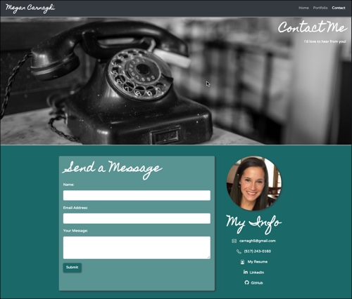

# Updated-Portfolio-2

## Table of Contents

- [Description](#description)
- [Technologies Used](#technologies-used)
- [Links](#links)
- [Screenshots](#screenshots)
- [License](#license)

## Description

A web-based portfolio built from scratch, featuring various coding projects I have worked on as well as my resume, contact information, link to my GitHub profile and link to my LinkedIn profile.

## Technologies Used

- HTML
- CSS
- Bootstrap
- Google Fonts
- Font Awesome
- Pexels

## Links

- Link to GitHub Repository: https://github.com/MeganCarnaghi/Updated-Portfolio-2.git

- Link to Deployed Application: https://megancarnaghi.github.io/Updated-Portfolio-2/index.html

## Screenshots

\
\

## License

